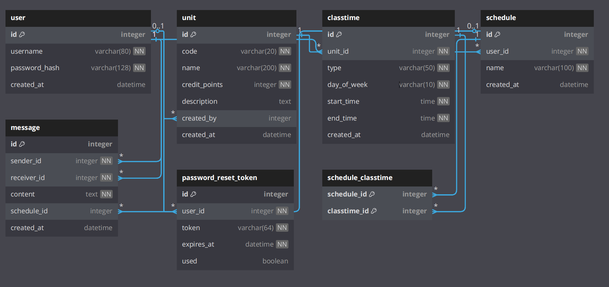

# Database Design Document

This document outlines the database design for a Flask and SQLAlchemy-based application managing users, course units, class times, schedules, messages, and password reset tokens. It includes detailed descriptions of table structures, fields, relationships, and constraints.

## Database Overview

The database consists of the following tables:

1. **user**: Stores user information, supporting authentication and linking to other entities.
2. **password_reset_token**: Stores password reset tokens for users.
3. **unit**: Stores course unit details.
4. **classtime**: Stores class time slots for units.
5. **schedule**: Stores user schedules.
6. **message**: Stores messages between users.
7. **schedule_classtime**: Association table for the many-to-many relationship between `schedule` and `classtime`.

---

## Table Structures

### 1. user Table

Stores user information for authentication and entity association.

| Field Name    | Data Type   | Constraints               | Description            |
| ------------- | ----------- | ------------------------- | ---------------------- |
| id            | Integer     | Primary Key               | Unique user identifier |
| username      | String(80)  | Unique, Not Null          | Username               |
| password_hash | String(128) | Not Null                  | Password hash          |
| created_at    | DateTime    | Default: Current UTC time | Creation timestamp     |

**Relationships**:

- One-to-Many: `unit` (via `unit.created_by`)
- One-to-Many: `schedule` (via `schedule.user_id`)
- One-to-Many: `message` (via `message.sender_id` and `message.receiver_id`)
- One-to-Many: `password_reset_token` (via `password_reset_token.user_id`)

---

### 2. password_reset_token Table

Stores password reset tokens for user password recovery.

| Field Name | Data Type  | Constraints                     | Description             |
| ---------- | ---------- | ------------------------------- | ----------------------- |
| id         | Integer    | Primary Key                     | Unique token identifier |
| user_id    | Integer    | Foreign Key (user.id), Not Null | Associated user         |
| token      | String(64) | Unique, Not Null                | Reset token             |
| expires_at | DateTime   | Not Null                        | Token expiration time   |
| used       | Boolean    | Default: False                  | Token usage status      |

**Relationships**:

- Many-to-One: `user` (via `user_id`)

---

### 3. unit Table

Stores course unit information, such as code, name, and credit points.

| Field Name    | Data Type   | Constraints               | Description            |
| ------------- | ----------- | ------------------------- | ---------------------- |
| id            | Integer     | Primary Key               | Unique unit identifier |
| code          | String(20)  | Unique, Not Null          | Course code            |
| name          | String(200) | Not Null                  | Course name            |
| credit_points | Integer     | Not Null                  | Credit points          |
| description   | Text        | Nullable                  | Course description     |
| created_by    | Integer     | Foreign Key (user.id)     | Creator user           |
| created_at    | DateTime    | Default: Current UTC time | Creation timestamp     |

**Relationships**:

- Many-to-One: `user` (via `created_by`)
- One-to-Many: `classtime` (via `classtime.unit_id`)

---

### 4. classtime Table

Stores class time slots for course units.

| Field Name  | Data Type  | Constraints                     | Description               |
| ----------- | ---------- | ------------------------------- | ------------------------- |
| id          | Integer    | Primary Key                     | Unique time slot ID       |
| unit_id     | Integer    | Foreign Key (unit.id), Not Null | Associated unit           |
| type        | String(50) | Not Null                        | Slot type (e.g., Lecture) |
| day_of_week | String(10) | Not Null                        | Day (e.g., Monday)        |
| start_time  | Time       | Not Null                        | Start time                |
| end_time    | Time       | Not Null                        | End time                  |
| created_at  | DateTime   | Default: Current UTC time       | Creation timestamp        |

**Relationships**:

- Many-to-One: `unit` (via `unit_id`)
- Many-to-Many: `schedule` (via `schedule_classtime` table)

---

### 5. schedule Table

Stores user schedules.

| Field Name | Data Type   | Constraints                     | Description        |
| ---------- | ----------- | ------------------------------- | ------------------ |
| id         | Integer     | Primary Key                     | Unique schedule ID |
| user_id    | Integer     | Foreign Key (user.id), Not Null | Associated user    |
| name       | String(100) | Not Null                        | Schedule name      |
| created_at | DateTime    | Default: Current UTC time       | Creation timestamp |

**Relationships**:

- Many-to-One: `user` (via `user_id`)
- Many-to-Many: `classtime` (via `schedule_classtime` table)
- One-to-Many: `message` (via `message.schedule_id`)

---

### 6. message Table

Stores messages between users, optionally linked to schedules.

| Field Name  | Data Type | Constraints                         | Description         |
| ----------- | --------- | ----------------------------------- | ------------------- |
| id          | Integer   | Primary Key                         | Unique message ID   |
| sender_id   | Integer   | Foreign Key (user.id), Not Null     | Sender user         |
| receiver_id | Integer   | Foreign Key (user.id), Not Null     | Receiver user       |
| content     | Text      | Not Null                            | Message content     |
| schedule_id | Integer   | Foreign Key (schedule.id), Nullable | Associated schedule |
| created_at  | DateTime  | Default: Current UTC time           | Creation timestamp  |

**Relationships**:

- Many-to-One: `user` (via `sender_id` and `receiver_id`)
- Many-to-One: `schedule` (via `schedule_id`)

**Note**: The original code had a duplicate `sender_id` column, which has been corrected to a single column in this document.

---

### 7. schedule_classtime Table

Association table for the many-to-many relationship between `schedule` and `classtime`.

| Field Name   | Data Type | Constraints                             | Description           |
| ------------ | --------- | --------------------------------------- | --------------------- |
| schedule_id  | Integer   | Foreign Key (schedule.id), Primary Key  | Associated schedule   |
| classtime_id | Integer   | Foreign Key (classtime.id), Primary Key | Associated class time |

**Relationships**:

- Links `schedule` and `classtime` tables.

---

## Relationships Diagram

The following outlines the key relationships between the database tables, illustrating how entities are interconnected:

- **user**:

  - **One-to-Many with unit**: A user can create multiple units (`unit.created_by` → `user.id`).
  - **One-to-Many with schedule**: A user can own multiple schedules (`schedule.user_id` → `user.id`).
  - **One-to-Many with message (sender)**: A user can send multiple messages (`message.sender_id` → `user.id`).
  - **One-to-Many with message (receiver)**: A user can receive multiple messages (`message.receiver_id` → `user.id`).
  - **One-to-Many with password_reset_token**: A user can have multiple password reset tokens (`password_reset_token.user_id` → `user.id`).
  - **unit**:
    - **Many-to-One with user**: Each unit is created by one user (`unit.created_by` → `user.id`).
    - **One-to-Many with classtime**: A unit can have multiple class time slots (`classtime.unit_id` → `unit.id`).
  - **classtime**:
    - **Many-to-One with unit**: Each class time slot belongs to one unit (`classtime.unit_id` → `unit.id`).
    - **Many-to-Many with schedule**: Class time slots can be included in multiple schedules, and schedules can include multiple class time slots (via the `schedule_classtime` association table).
  - **schedule**:
    - **Many-to-One with user**: Each schedule belongs to one user (`schedule.user_id` → `user.id`).
    - **Many-to-Many with classtime**: Schedules can include multiple class time slots, and class time slots can appear in multiple schedules (via the `schedule_classtime` association table).
    - **One-to-Many with message**: A schedule can be referenced by multiple messages (`message.schedule_id` → `schedule.id`).
  - **message**:
    - **Many-to-One with user (sender)**: Each message is sent by one user (`message.sender_id` → `user.id`).
    - **Many-to-One with user (receiver)**: Each message is received by one user (`message.receiver_id` → `user.id`).
    - **Many-to-One with schedule**: Each message can optionally reference one schedule (`message.schedule_id` → `schedule.id`).
  - **password_reset_token**:
    - **Many-to-One with user**: Each password reset token belongs to one user (`password_reset_token.user_id` → `user.id`).
  - **schedule_classtime**:

    - **Many-to-Many Link**: Connects `schedule` (`schedule_classtime.schedule_id` → `schedule.id`) and `classtime` (`schedule_classtime.classtime_id` → `classtime.id`) to facilitate the many-to-many relationship.

  - 
